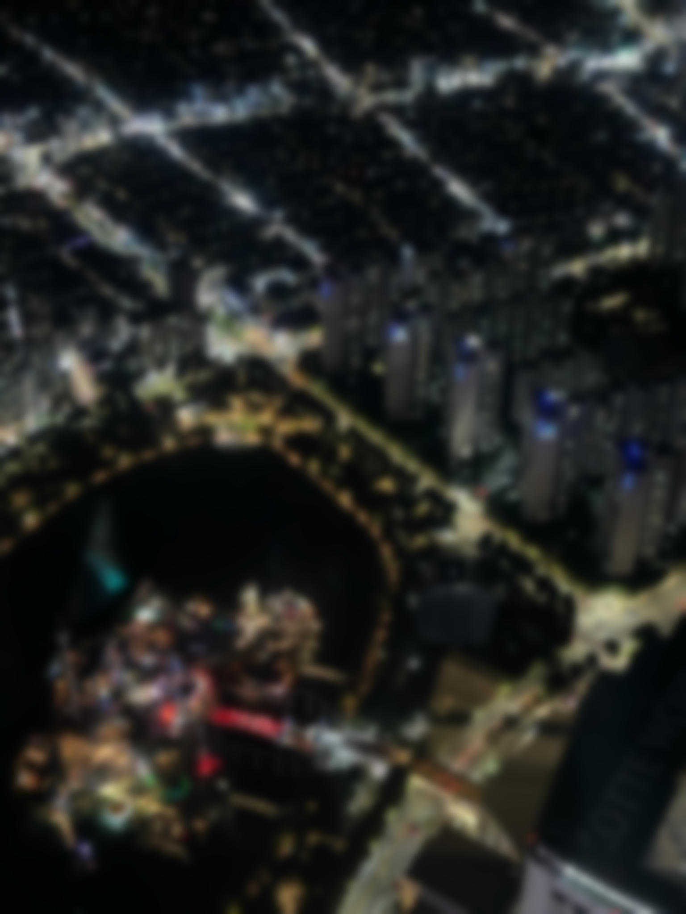
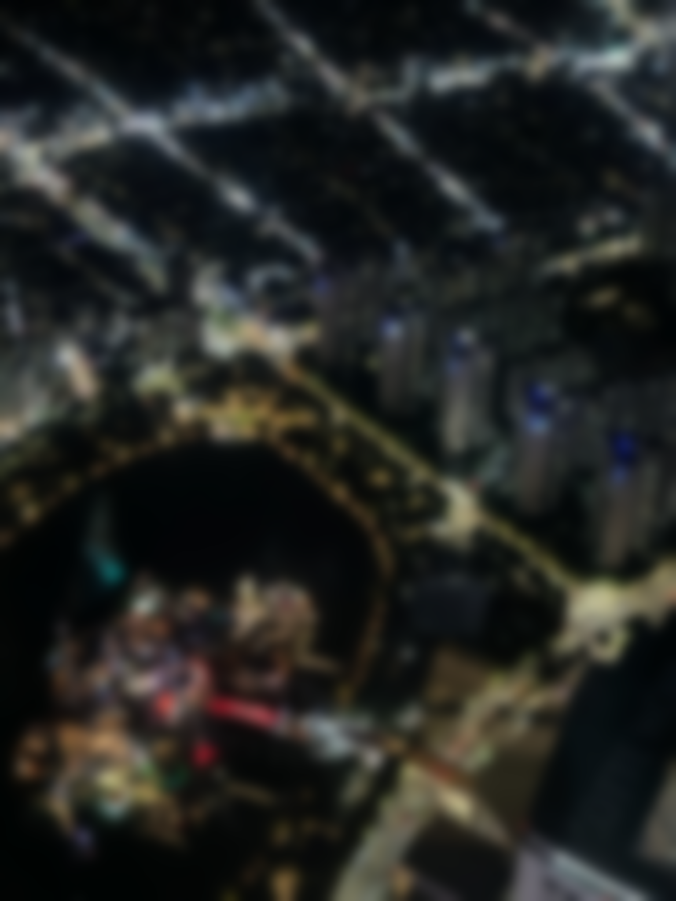

# 🌟Image Processing Effects Implementation 

## Overview
서울 야경 이미지에 다양한 이미지 처리 효과를 구현한 실험 결과.
BoxBlur, GaussianBlur, Bloom 을 단계적으로 적용하여 비교.

## Results Gallery

| Original | Bloom | GaussianBlur | BoxBlur |
|----------|---------|--------------|-------|
|  |  |  |  |

## Key Implementation

### BoxBlur5
5×5 박스 필터를 이용한 Separable Convolution 구현

```cpp
void Image::BoxBlur5()
{
    std::vector<Vec4> pixelsBuffer(this->pixels.size());

    #pragma omp parallel for
    for (int j = 0; j < this->height; j++) {
        for (int i = 0; i < this->width; i++) {
            Vec4 temp{ 0.0f, 0.0f, 0.0f, 1.0f };
            for (int k = 0; k < 5; k++) {
                Vec4 neighbor = this->GetPixel(i + k - 2, j);
                temp.v[0] += neighbor.v[0];
                temp.v[1] += neighbor.v[1];
                temp.v[2] += neighbor.v[2];
            }
            pixelsBuffer[i + j * this->width].v[0] = temp.v[0] * 0.2f;
            pixelsBuffer[i + j * this->width].v[1] = temp.v[1] * 0.2f;
            pixelsBuffer[i + j * this->width].v[2] = temp.v[2] * 0.2f;
        }
    }
    std::swap(this->pixels, pixelsBuffer);

    #pragma omp parallel for
    for (int j = 0; j < this->height; j++) {
        for (int i = 0; i < this->width; i++) {
            Vec4 temp{ 0.0f, 0.0f, 0.0f, 1.0f };
            for (int k = 0; k < 5; k++) {
                Vec4 neighbor = this->GetPixel(i, j + k - 2);
                temp.v[0] += neighbor.v[0];
                temp.v[1] += neighbor.v[1];
                temp.v[2] += neighbor.v[2];
            }
            pixelsBuffer[i + j * this->width].v[0] = temp.v[0] * 0.2f;
            pixelsBuffer[i + j * this->width].v[1] = temp.v[1] * 0.2f;
            pixelsBuffer[i + j * this->width].v[2] = temp.v[2] * 0.2f;
        }
    }
    std::swap(this->pixels, pixelsBuffer);
}
```

### GaussianBlur5
가우시안 가중치를 적용한 Separable Convolution

```cpp
void Image::GaussianBlur5()
{
    std::vector<Vec4> pixelsBuffer(this->pixels.size());
    const float weights[5] = { 0.0545f, 0.2442f, 0.4026f, 0.2442f, 0.0545f };

    #pragma omp parallel for
    for (int j = 0; j < this->height; j++) {
        for (int i = 0; i < this->width; i++) {
            Vec4 temp{ 0.0f, 0.0f, 0.0f, 1.0f };
            for (int k = 0; k < 5; k++) {
                Vec4 neighbor = this->GetPixel(i + k - 2, j);
                temp.v[0] += neighbor.v[0] * weights[k];
                temp.v[1] += neighbor.v[1] * weights[k];
                temp.v[2] += neighbor.v[2] * weights[k];
            }
            pixelsBuffer[i + j * this->width].v[0] = temp.v[0];
            pixelsBuffer[i + j * this->width].v[1] = temp.v[1];
            pixelsBuffer[i + j * this->width].v[2] = temp.v[2];
        }
    }
    std::swap(this->pixels, pixelsBuffer);

    #pragma omp parallel for
    for (int j = 0; j < this->height; j++) {
        for (int i = 0; i < this->width; i++) {
            Vec4 temp{ 0.0f, 0.0f, 0.0f, 1.0f };
            for (int k = 0; k < 5; k++) {
                Vec4 neighbor = this->GetPixel(i, j + k - 2);
                temp.v[0] += neighbor.v[0] * weights[k];
                temp.v[1] += neighbor.v[1] * weights[k];
                temp.v[2] += neighbor.v[2] * weights[k];
            }
            pixelsBuffer[i + j * this->width].v[0] = temp.v[0];
            pixelsBuffer[i + j * this->width].v[1] = temp.v[1];
            pixelsBuffer[i + j * this->width].v[2] = temp.v[2];
        }
    }
    std::swap(this->pixels, pixelsBuffer);
}
```

### Bloom
밝은 부분 추출 + GaussianBlur + 원본 합성

```cpp
void Image::Bloom(const float& th, const int& numRepeat, const float& weight)
{
    const std::vector<Vec4> pixelsBackup = this->pixels;

    for (int j = 0; j < height; j++)
        for (int i = 0; i < width; i++) {
            Vec4 temp = this->GetPixel(i, j);
            float thCheck = 0.2126f * temp.v[0] + 0.7152f * temp.v[1] + 0.0722f * temp.v[2];
            
            if (thCheck < th) {
                this->pixels[i + j * this->width].v[0] = 0.0f;
                this->pixels[i + j * this->width].v[1] = 0.0f;
                this->pixels[i + j * this->width].v[2] = 0.0f;
            }
        }

    for (int i = 0; i < numRepeat; i++) {
        this->GaussianBlur5();
    }

    for (int i = 0; i < pixelsBackup.size(); i++) {
        pixels[i].v[0] = std::clamp(pixelsBackup[i].v[0] + weight * this->pixels[i].v[0], 0.0f, 1.0f);
        pixels[i].v[1] = std::clamp(pixelsBackup[i].v[1] + weight * this->pixels[i].v[1], 0.0f, 1.0f);
        pixels[i].v[2] = std::clamp(pixelsBackup[i].v[2] + weight * this->pixels[i].v[2], 0.0f, 1.0f);
    }
}
```

## 💻 System Specifications 
- **CPU**: AMD Ryzen 7 7800X3D (8 cores)
- **GPU**: NVIDIA RTX 4070 Ti Super 16GB
- **RAM**: 32GB DDR5
- **Image Resolution**: 1536×2048 (iPhone 12 Pro)
- **Development**: Visual Studio 2022, DirectX 11, OpenMP
