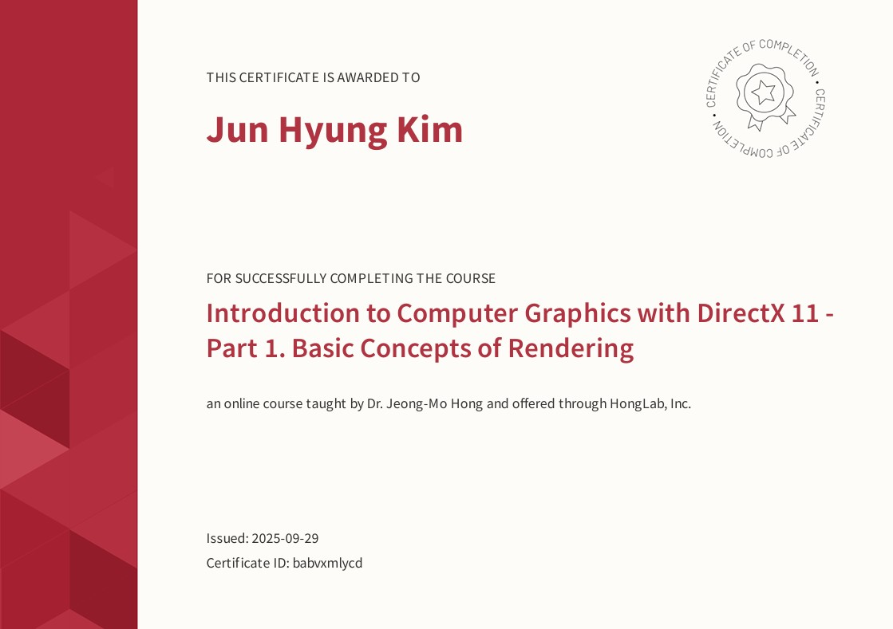

# Computer Graphics

A repository for learning 3D graphics programming with OpenGL, and DirectX11.

## Overview

This repository contains projects and examples for exploring modern computer graphics APIs:

- **OpenGL** - Cross-platform 3D graphics rendering
- **DirectX11** - Windows-based 3D graphics programming

## Certification

  

## License

This project is for educational purposes.
