# Computer Graphics

A repository for learning OpenGL based on the [LearnOpenGL](https://learnopengl.com/) tutorial.

---

## OpenGL Learning Results

<table>
  <tr>
    <td align="center">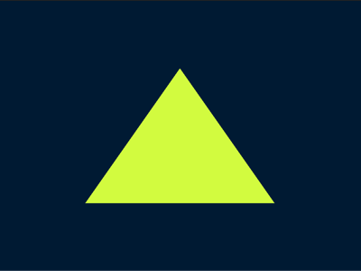 Triangle</td>
    <td align="center"> Rectangle</td>
    <td align="center">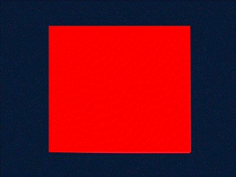 Uniform Qualifier</td>
    <td align="center">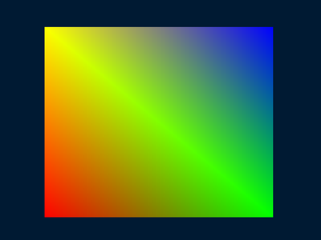 Vertex Attributes</td>
  </tr>
  <tr>
    <td align="center">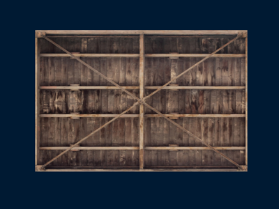 Texture</td>
    <td align="center">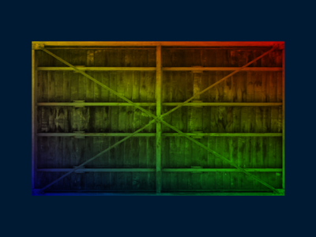 Texture + RGB</td>
    <td align="center">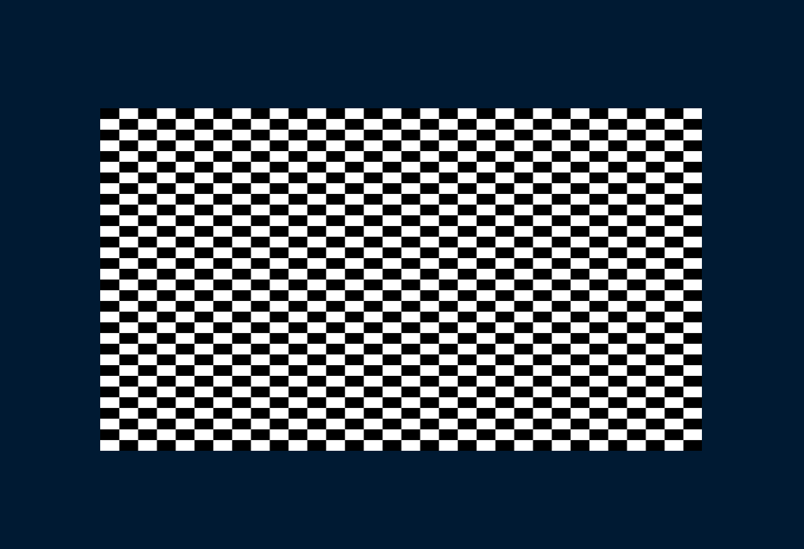 Checker Pattern</td>
    <td align="center">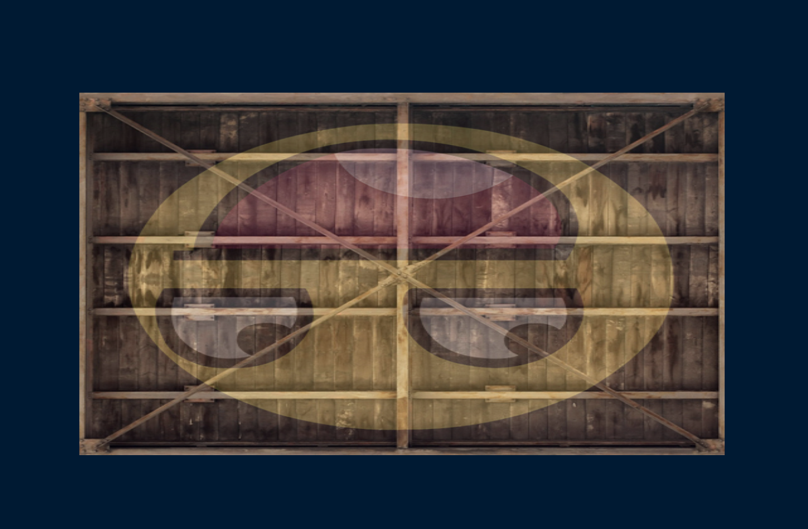 Multiple Textures</td>
  </tr>
  <tr>
    <td align="center"> 3D Transform</td>
    <td align="center">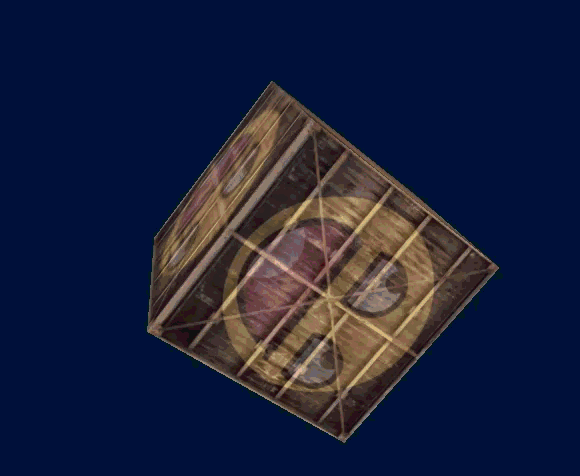 Single Cube</td>
    <td align="center">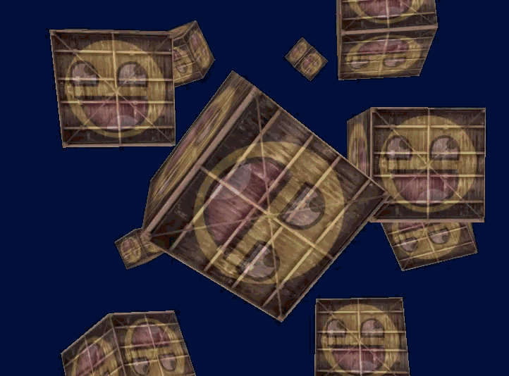 Multiple Cubes</td>
    <td align="center"> Textured Cubes</td>
  </tr>
  <tr>
    <td align="center">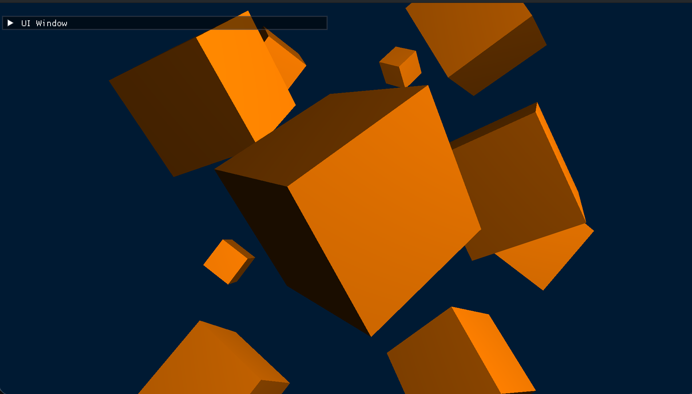 Diffuse Lighting</td>
    <td align="center">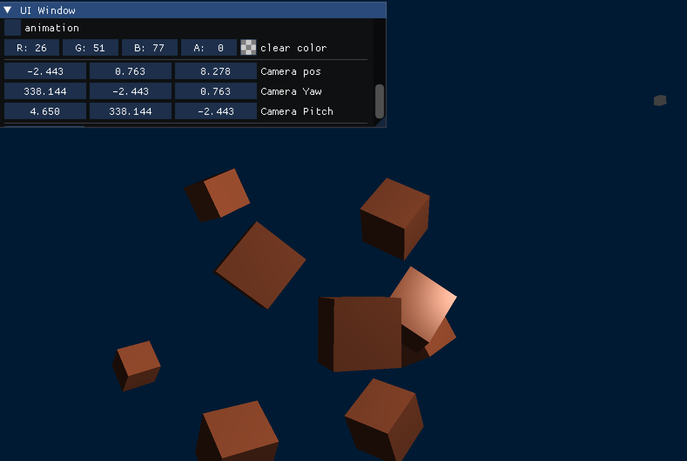 Specular Lighting</td>
    <td align="center">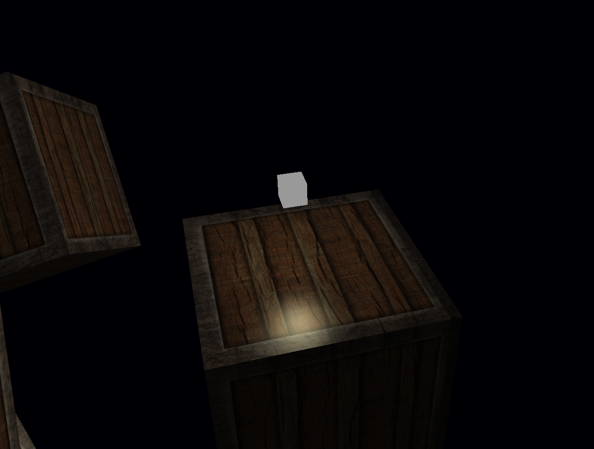 Lighting Scene</td>
    <td align="center"> Spot Light</td>
  </tr>
  <tr>
    <td align="center"> Spot Light Smoothing</td>
    <td align="center"> Scene Setup</td>
    <td align="center"> Depth Visualization</td>
    <td align="center"> Model Loading</td>
  </tr>
</table>

---

## License

This project is for educational purposes.
